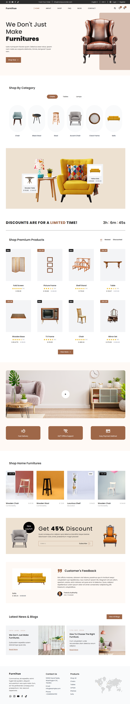

# Furnitue

Responsive furniture website built with HTML & CSS, designed to highlight stylish interiors with a clean, user-friendly interface.

---

## 📸 Preview

  

---

## 🚀 Live Demo
🔗 [View Website](https://furnitue.netlify.app/)

---

## ✨ Highlights
- Fully responsive layout
- Clean, modern typography
- Smooth scrolling between sections
- Modern product design
- Simple, easy-to-read code structure

---

## 👤 Author
**Oladapo Authority**  
- GitHub: [@deauthor1234](https://github.com/deauthor1234)
